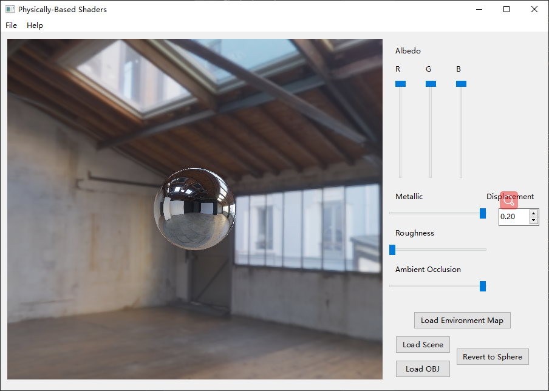
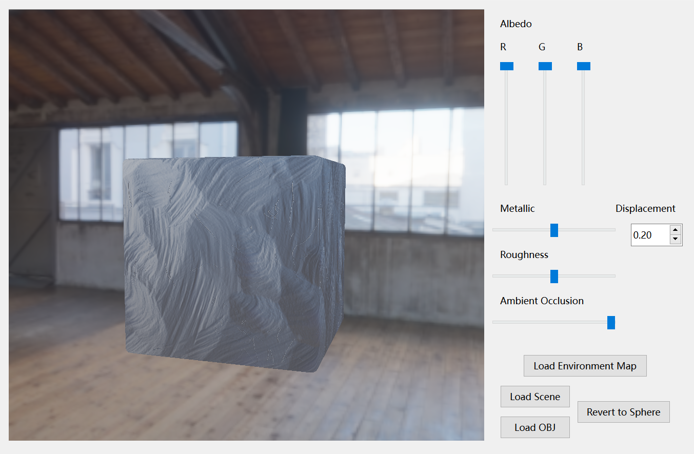

Physically-Based Shaders Part I: Point Lights
======================

**University of Pennsylvania, CIS 561: Advanced Computer Graphics, Homework 7**

Yilin Liu

31955379

## Results

### Figure 1

### Figure 2

### Figure 3

### Figure 4

### Figure 5

### Figure 6

Overview
------------
You will implement an OpenGL shader that computes an approximation of the Light Transport Integral. The material model you will use is a microfacet BSDF that can represent some value on the scale of of plasticness to metallicness, and some level of surface roughness. For this assignment, we will assume the only light sources in the scene are point lights, in order to greatly simplify our computations. Recall that the overall formula for this BSDF is  + 

Here are some example screenshots of what your implementation should look like with varying amounts of roughness and metallicness:

 

 

The Light Transport Equation
--------------
#### Lo(p, &#969;o) = Le(p, &#969;o) + &#8747;S f(p, &#969;o, &#969;i) Li(p, &#969;i) V(p', p) |dot(&#969;i, N)| _d_&#969;i

* __Lo__ is the light that exits point _p_ along ray &#969;o.
* __Le__ is the light inherently emitted by the surface at point _p_
along ray &#969;o.
* __&#8747;S__ is the integral over the sphere of ray
directions from which light can reach point _p_. &#969;o and
&#969;i are within this domain.
* __f__ is the Bidirectional Scattering Distribution Function of the material at
point _p_, which evaluates the proportion of energy received from
&#969;i at point _p_ that is reflected along &#969;o.
* __Li__ is the light energy that reaches point _p_ from the ray
&#969;i. This is the recursive term of the LTE.
* __V__ is a simple visibility test that determines if the surface point _p_' from
which &#969;i originates is visible to _p_. It returns 1 if there is
no obstruction, and 0 is there is something between _p_ and _p_'. This is really
only included in the LTE when one generates &#969;i by randomly
choosing a point of origin in the scene rather than generating a ray and finding
its intersection with the scene.
* The __absolute-value dot product__ term accounts for Lambert's Law of Cosines.

Updating this README (5 points)
-------------
Make sure that you fill out this `README.md` file with your name and PennKey,
along with your example screenshots. For this assignment, you should take screenshots of your OpenGL window with the following configurations:
- 0% metallic, 50% rough, RBG = 0 1 0
- 100% metallic, 50% rough, RGB = 0.5 0.5 1
- 50% metallic, 25% rough, RGB = 0.5 0 0

Where to write code
-----------------
All code written for this point-light based PBR shader will be implemented in `pbr.frag.glsl`. When we move to environment map lighting next week, we will also write some C++ code.

Point light intensity falloff (5 points)
--------------
The intensity of each point light's irradiance should be inversely proportional to the squared distance between that light and the point illuminated by it. We have provided the base radiance of each point light in the `light_col` array. You must take each of these values and attenuate them based on distance.

Cook-Torrance BRDF (55 points)
----------
The portion of this BSDF that deals with glossy reflection is the Cook-Torrance BRDF. Recall that this BRDF's formulation is
. You must compute its value for each of the light sources in the provided scene (i.e. for each incoming light ray). Refer to the formulas provided in the PBR Shaders lecture slides for the D, F, and G terms.

Lambertian BRDF (20 points)
----------
The portion of this BSDF that deals with diffuse reflection is the Lambertian BRDF. You must compute its value for each of the incoming light rays in the scene.

Diffuse and Glossy Coefficients (10 points)
----------------
You must attenuate the Cook-Torrance and Lambertian BSDF components such that they sum up to a value less than or equal to 1. This ensures that the BSDF is energy-conserving, and is thus physically correct.

Recall that  and that .

Ambient light (5 points)
-------------
We will introduce a small amount of ambient light (intensity = 0.03 * ambient occlusion * albedo). Make sure you factor this into your renders if you want to match the example renders.

Color space remapping and gamma correction (5 points)
------------
Since we will be working in HDR (linear) color space, you will need to remap your color back to sRGB values before outputting them. To do this, first apply the Reinhard operator to your Lo term, followed by gamma correction with an exponent of `(1 / 2.2)`.

Extra credit (20 points maximum)
-----------
Implement 3D noise functions (e.g. the ones we discussed in CIS 460) in your shader that modify surface material attributes in order to provide more interesting variation across your surfaces. For example, you might make your surface look like rusted metal by applying "rust" patches with FBM, whose Metallicness is lower and whose Roughness is higher than the surrounding areas. This is just one example, there are all sorts of ways you could procedurally material your sphere.

The more interesting your surface appearance, the more points you will receive. You can also implement multiple, simpler procedural materials to receive more credit.

Submitting your project
--------------
Along with your project code, make sure that you fill out this `README.md` file
with your name and PennKey, along with your test renders.

Rather than uploading a zip file to Canvas, you will simply submit a link to
the committed version of your code you wish us to grade. If you click on the
__Commits__ tab of your repository on Github, you will be brought to a list of
commits you've made. Simply click on the one you wish for us to grade, then copy
and paste the URL of the page into the Canvas submission form.
